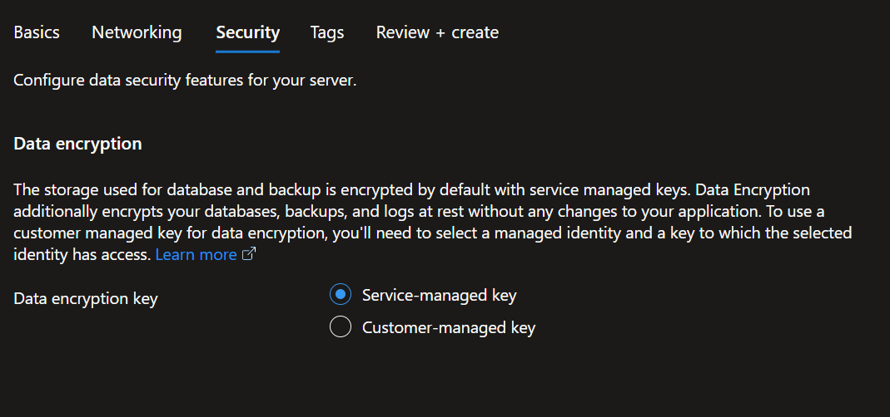
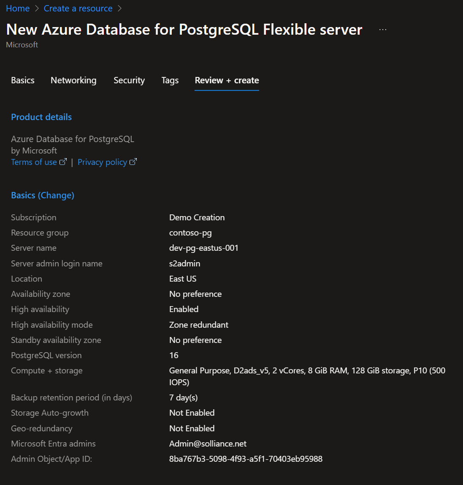
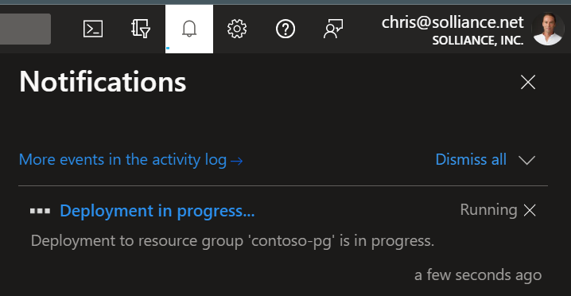
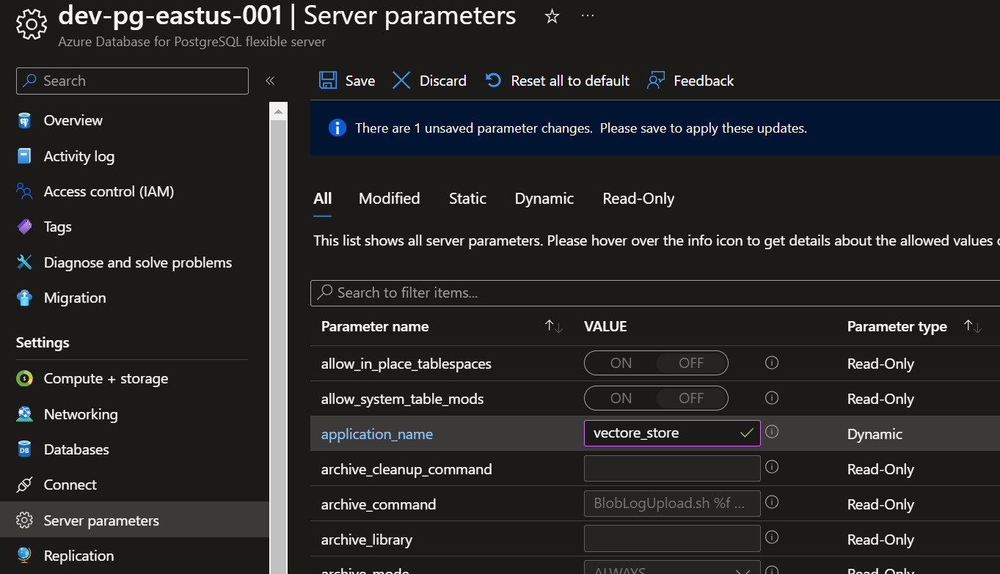
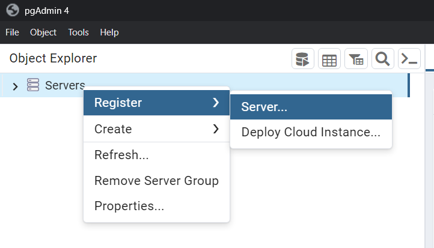
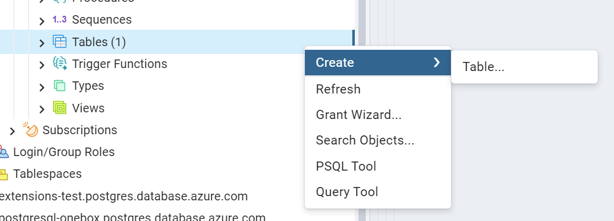
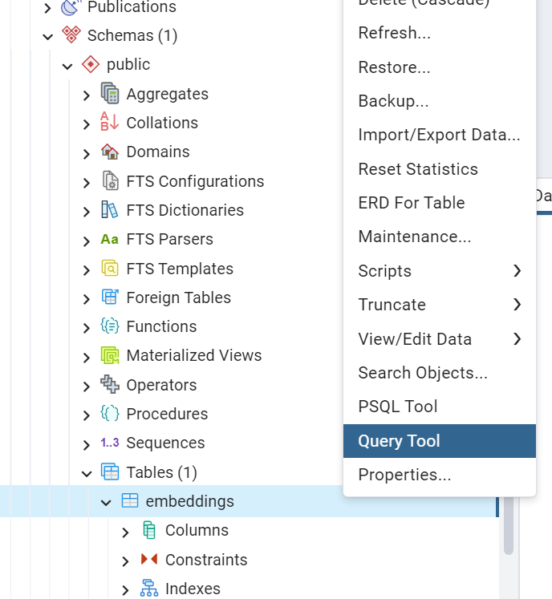

# Hand on lab: Provisioning, configuring, and getting started with development

In this lab you will create an Azure Database for PostgreSQL Flexible Server, configure it using the Azure Portal, Azure CLI and Azure REST APIs.  Once created and configured, you will then connect to it using pgAdmin to add a new 1532 dimension vector column.

## Pre-requistes

- [Azure subscription](https://azure.microsoft.com/free/)
- [Resource group](https://learn.microsoft.com/en-us/azure/azure-resource-manager/management/manage-resource-groups-portal)
- Optional - Computer with Postgres 16 and pgAdmin

## Creating an Azure Database for Postgres Flexible Server

- Open the [Azure Portal](https://portal.azure.com/).
- Select **Create a resource (+)** in the upper-left corner of the portal or select **Create a resource** under **Azure services**.

    

- In the left side navigation, select **Databases**
- Under **Azure Database for PostgreSQL Flexible Server**, select **Create**

    

- Fill out the Basics tab with the following information:
  - Resource Group: Name of your lab resource group
  - Server name:  `PREFIX-pg-flex-eastus-16`
  - Region: `East US`
  - PostgreSQL Version: `16`
  - Workload Type: `Production (Small/Medium-size)`
  
    

  - Under **Compute + Storage**, select **Configure Server**
  - For the size, select `Standard_D2ds_v5`

    
  
  - Select **Save**

  - Authentication method: `PostgreSQL and Microsoft Entra authentication`
  - Admin username: `s2admin`
  - Password and confirm password: `Seattle123Seattle123`

    

- Select **Next: Networking**. On the Networking tab, you can choose how your server is reachable.
- Configure Networking options:
  - Select **Public access (allowed IP addresses)**

    

  - Add your client IP address to ensure you can connect to your new instance:
  
    

- Select **Next: Security**

    

- Select **Next: Tags**
  
  

- Select **Review + create** to review your selections.

    

- Select **Create** to provision the server. This operation may take a few minutes.
- In the top right of the toolbar, select the Notifications icon (a bell)

    

- Select **Deployment in progress** link.  You can now monitor the deployment process:

    

- Once deployed, select the link to navigate to your server's **Overview** page.
  - Make a note of the Server name and the Server admin login name.
  - Hover your cursor over each field, and the copy symbol appears to the right of the text.
  - Select the copy symbol as needed to copy the values for use later:
    - Subscription ID
    - Resource Group
    - Resource name
    - Server name

    

## Configuring backup retention using Azure REST API

The Azure portal makes calls to the Azure Management API similar to how the Azure CLI and Powershell does.

- Open a new PowerShell window, run the following commands. Be sure to set the subscritionId and resourceGroup variables with the values you copied from above:

```PowerShell
$token = $(Get-AzAccessToken -ResourceUrl "https://management.azure.com/").token

$subscriptionId = "REPLACE_THIS"
$resourceGroup = "REPLACE_THIS"
$resourceName = "REPLACE_THIS"

$content = "{""properties"":{""Backup"":{""backupRetentionDays"":35}}}"

$url = "https://management.azure.com/subscriptions/$subscriptionId/resourceGroups/$resourceGroup/providers/Microsoft.DBforPostgreSQL/flexibleServers/$($resourceName)?api-version=2023-06-01-preview"

$headers = @{
 "Authorization" = "Bearer $token"
 'content-type' = 'application/json'
}

Invoke-WebRequest -Method PATCH -Uri $url -Headers $headers -Body $content
```

## Adding a database in the portal

- Under **Settings**, select **Databases**
- In the meny, select **+Add**
- For the name, type **airbnb**

    

- Select **Save**

## Configuring maintenance

- Under **Settings**, select **Maintenance**
- Select **Custom schedule**
- For the **Day of week**, select **Saturday**
- For the **Start time (UTC)**, select **23**
  
  

- Select **Save**

## Configuring a server parameter  

- Under **Settings**, select **Server parameters**.
- For the **appliction_name** server parameter, type **airbnb**.
  
  

- Select **Save**, notice an azure deployment is started.
- After the deployment is complete, navigate back to the **Server parameters**.
- In the tabs, select **Static**, notice only static items are shown.
- Search for **max_connections**, then highlight the info icon. Notice the values range from 25 to 5000.
  
  

- Modify the value to **2000**
- In the tabs, select **All**
- Search for **azure.extensions**
- Enable the **VECTOR** extension

    

- Select **Save**.
- In the dialog, select **Save and Restart**

## Setup Additional Lab Resources

In order to support the remaining items, you will need to execute the following ARM tempalte in your resource group:

- Switch to the Azure Portal
- Browse to your resource group
- Under **Settings**, select **Deployments**
- Select any deployment (ex **PostgreSqlFlexibleServer_**) and in the tabs, select **Redeploy**
- Select **Edit template**
- Copy and paste the `/artifacts/template.json` file into the window
- Select **Save**
- Set the prefix parameter to the `PREFIX` you used previously.
- Select **Review + create**
- Select **Create**, the deployment will take a few minutes.  Once deployed, you will have:
  - Two PostgreSQL servers (14 and 16).
  - Windows 10 Virtual Machine with necessary software installed.
  - Various Azure supporting services

## Connecting with PG Admin

If you have a laptop or desktop that has pgAdmin and PostgreSQL installed, you can perform these steps on that machine.  If you do not, you can utilize the virtual machine that was deployed to your resource group from teh previous step.

If you are using your own device, ensure the following:

- Download and Install [pgAdmin](https://www.pgadmin.org/download/)
- Download and Install [PostgreSQL 16]()
- Switch back to the Azure Portal
- Browse to the `PREFIX-pg-flex-eastus-16` instance
- Under **Settings**, select **Networking**
- Under **Firewall rules**, add an entry for the IP address of your device
- Select **Save**
- Repeat for the `PREFIX-pg-flex-eastus-14` instance

If you are using the virtual machine, all the software has been installed (or in process of being installed).  Login using the following:

- Switch to the Azure Portal
- Browse to your resource group
- Select the **Blah** virtual machine
- In the tabs, select **Connect->Connect**
- Copy and save the IP address
- Select **Download RDP file**
- Open the RDP file with Remote Desktop
- Select **Connect**
- Login with `s2admin` and password `Seattle123Seattle123`
- When prompted, select **Next**, then **Accept**
- Switch back to the Azure Portal
- Browse to the `PREFIX-pg-flex-eastus-16` instance
- Under **Settings**, select **Networking**
- Under **Firewall rules**, add an entry using the IP address you copied above
- Select **Save**
- Repeat for the `PREFIX-pg-flex-eastus-14` instance

Continue with the lab steps:

- Open **pgAdmin**
- Right-click the **Servers** node, select **Register->Server**
  
  

- For name, type **PREFIX-pg-flex-eastus-16**
- Select the **Connection** tab
- For the **host name/address**, paste the server name you copied from above
- For the username, type **s2admin**
- For the password, type **Seattle123Seattle123**
- Select **Save password?** to toggle it on.
- Select **Save**

## Writing your first query

Using pgAdmin, you will add a new vector column to support OpenAI embeddings.

- Expand the **PREFIX-pg-flex-eastus-16** node
- Expand the **Databases** node
- Expand the **airbnb->Schemas->public** nodes
- Right-click the **Tables** node, select **Create->Table**
  
  

- For the name, type **embeddings**
- Select **Save**
- Right-click the new `embeddings` table, select **Query Tool**
  
  

- Copy the following into the query tool window, this will create a typical Open AI vector column based on 1536 dimensions:

```sql
CREATE EXTENSION vector;

ALTER TABLE embeddings ADD COLUMN embedding vector(1536);
```

## Summary

In this lab, you created a new Azure Database for PostgreSQL Flexible Server instance, configured it, added a database called `airbnb` with a `embeddings` table that included a vector column.  

In the next set of labs, you will explore the new developer and intrastructure features of PostgreSQL 16.
