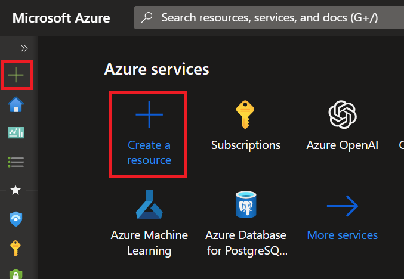
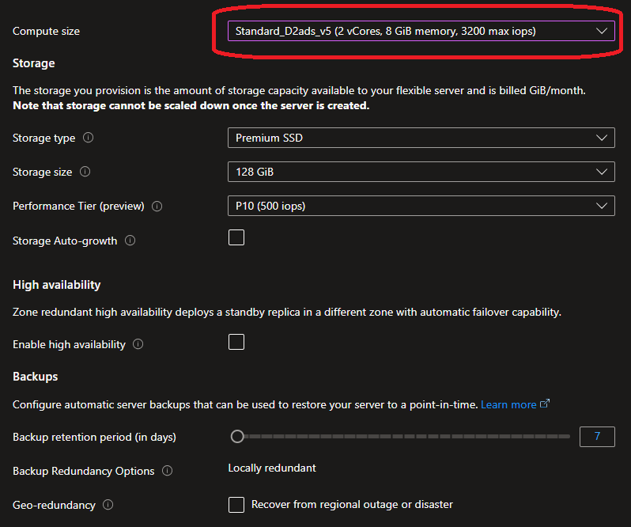
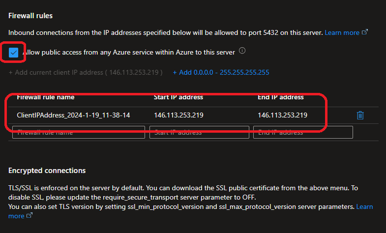

# Hands on Lab: Provisioning, configuring, and getting started with development

- [Hands on Lab: Provisioning, configuring, and getting started with development](#hands-on-lab-provisioning-configuring-and-getting-started-with-development)
  - [Prerequisites](#prerequisites)
  - [Exercise 1: Creating an Azure Database for PostgreSQL Flexible Server](#exercise-1-creating-an-azure-database-for-postgresql-flexible-server)
  - [Exercise 2: Adding a database in the portal](#exercise-2-adding-a-database-in-the-portal)
  - [Exercise 3: Configuring maintenance](#exercise-3-configuring-maintenance)
  - [Exercise 4: Connecting with pgAdmin](#exercise-4-connecting-with-pgadmin)
    - [Task 1: Networking Setup (Local Device) - OPTIONAL](#task-1-networking-setup-local-device---optional)
    - [Task 2: Networking Setup (Lab Environment)](#task-2-networking-setup-lab-environment)
    - [Task 2: Add Server to pgAdmin](#task-2-add-server-to-pgadmin)
  - [Exercise 5: Writing your first query](#exercise-5-writing-your-first-query)
  - [Summary](#summary)
  - [Miscellanous](#miscellanous)

In this lab you will create an [Azure Database for PostgreSQL Flexible Server](https://learn.microsoft.com/en-us/azure/postgresql/flexible-server/overview) and then configure various properties using the Azure Portal. Once created and configured, you will then connect to it using [pgAdmin](https://www.pgadmin.org/) to run some basic queries on pre-loaded data.

## Prerequisites

- [Azure subscription](https://azure.microsoft.com/free/)
- Optional - Computer with [Postgres 16](https://www.postgresql.org/download/) and [pgAdmin](https://www.pgadmin.org/)

## Exercise 1: Creating an Azure Database for PostgreSQL Flexible Server

In this exercise you will create a new Azure Database for PostgreSQL Flexible Server using the Azure Portal.

- Open the [Azure Portal](https://portal.azure.com/), if prompted, login using your lab credentials
- Select **Create a resource (+)** in the upper-left corner of the portal or select **Create a resource** under **Azure services**.

    

- In the left side navigation, select **Databases**
- Under **Azure Database for PostgreSQL Flexible Server**, select **Create**

    

- Fill out the Basics tab with the following information, be sure to replace `PREFIX` with your lab information:
  - Resource Group: Name of your lab resource group
  - Server name:  `PREFIX-pg-flex-eastus-16`
  - Region: `East US`
  - PostgreSQL Version: `16`
  - Workload Type: `Production (Small/Medium-size)`
  
    

  - Under **Compute + Storage**, select **Configure Server**
  - For the size, select `Standard_D2ds_v5`
  - Please **DO NOT** select the **High Availability** option as it is subject to availability and capacity limits in various regions.

    
  
  - Select **Save**
  - Authentication method: `PostgreSQL`
  - Admin username: `s2admin`
  - Password and confirm password: `Seattle123Seattle123`

    

- Select **Next: Networking**. On the Networking tab, you can choose how your server is reachable.
- Configure Networking options:
  - Select **Public access (allowed IP addresses)**

  

  - Add your client IP address to ensure you can connect to your new instance

    > NOTE: You can find your IP Address by using a service such as [What Is My IP Address](https://whatismyipaddress.com/)

  - Additonally, select the **Allow public access from any Azure service with Azure to the server**
  
  

- Select **Review + create** to review your selections.

  

- Select **Create** to provision the server. This operation may take a few minutes.
- In the top right of the toolbar, select the Notifications icon (a bell)

  

- Select **Deployment in progress** link.  You can now monitor the deployment process:

  

- Once deployed, select the link to navigate to your server's **Overview** page.
  - Make a note of the Server name and the Server admin login name.
  - Hover your cursor over each field, and the copy symbol appears to the right of the text.
  - Select the copy symbol as needed to copy the values for use later:
    - Subscription ID
    - Resource Group
    - Resource name
    - Server name

  

## Exercise 2: Adding a database in the portal

In this exercise you will use the Azure Portal to add a new database to your newly created Azure Database for PostgreSQL Flexible Server.

- Under **Settings**, select **Databases**
- In the menu, select **+Add**
- For the name, type **airbnb**

    

- Select **Save**

## Exercise 3: Configuring maintenance

In this exercise you will modify the [maintennce schedule](https://learn.microsoft.com/en-us/azure/postgresql/flexible-server/concepts-maintenance) of your Azure Database for PostgreSQL Flexible Server. By changing the scheulde you can match the Azure update schedule to your own internal update schedule.

- Under **Settings**, select **Maintenance**
- Select **Custom schedule**
- For the **Day of week**, select **Saturday**
- For the **Start time (UTC)**, select **23**
  
  

- Select **Save**

## Exercise 4: Connecting with pgAdmin

If you have a laptop or desktop that has pgAdmin and PostgreSQL installed, you can perform these steps on that machine.  If you do not, you can utilize the virtual machine that was deployed to your lab environment.

### Task 1: Networking Setup (Local Device) - OPTIONAL

If you are using your own device, ensure the following has been completed:

- Download and Install [pgAdmin](https://www.pgadmin.org/download/)
- Download and Install [PostgreSQL 16](https://www.postgresql.org/download/)
- Switch back to the Azure Portal
- Browse to the `PREFIX-pg-flex-eastus-16` instance
- Under **Settings**, select **Networking**
- Ensure that the **Allow public access from any Azure service within Azure to this server** checkbox in selected.
- Under **Firewall rules**, add an entry for the IP address of your device.

    > NOTE: You can find your IP Address by using a service such as [What Is My IP Address](https://whatismyipaddress.com/)

- Select **Save**
- Repeat for the `PREFIX-pg-flex-eastus-14` instance

### Task 2: Networking Setup (Lab Environment)

If you are using the virtual machine from the lab environment, all the software has been installed for you. Login using the following:

- Switch to the Azure Portal
- Browse to your resource group
- Select the **PREFIX-paw-1** virtual machine
- In the tabs, select **Connect->Connect**
- Copy and save the IP address
- Select **Download RDP file**
- Open the RDP file with Remote Desktop
- Select **Connect**
- Login with `s2admin` and password `Seattle123Seattle123`
- When prompted, select **Next**, then **Accept**
- Switch back to the Azure Portal
- Browse to the `PREFIX-pg-flex-eastus-16` instance
- Under **Settings**, select **Networking**
- Ensure that the **Allow public access from any Azure service within Azure to this server** checkbox in selected.
- Under **Firewall rules**, add an entry using the IP address you copied above

    > NOTE: You can find your IP Address by using a service such as [What Is My IP Address](https://whatismyipaddress.com/)

- Select **Save**
- Repeat for the `PREFIX-pg-flex-eastus-14` instance

### Task 2: Add Server to pgAdmin

- From the lab virtual machine, open **pgAdmin**
- Right-click the **Servers** node, select **Register->Server**
  
  

- For name, type **PREFIX-pg-flex-eastus-16**, be sure to replace `PREFIX` with your lab information
- Select the **Connection** tab
- For the **host name/address**, paste the server name you copied from above
- For the username, type **s2admin**
- For the password, type **Seattle123Seattle123**
- Select **Save password?** to toggle it on.
- Select **Save**

## Exercise 5: Writing your first query

Using pgAdmin, you will execute some basic queries

- Switch to pgAdmin
- Expand the **PREFIX-pg-flex-eastus-14** node
- Expand the **Databases** node
- Expand the **airbnb->Schemas->public** nodes
- Expand the **Tables** node
- Right-click the new `airbnb` table, select **Query Tool**
- Copy the following into the query tool window:

```sql
TODO
```

## Summary

In this lab, you created a new Azure Database for PostgreSQL Flexible Server instance, configured some various ascpects of it, added a database called `airbnb` and then explored its data using pgAdmin.  

In the next set of labs, you will explore the new developer and infrastructure features of PostgreSQL 16.

## Miscellanous

If you would like to run these labs in your own Azure subscription, you will need to execute the following ARM template:

- Switch to the Azure Portal
- Select the **+** in the top left
- Search for **template**, select the **Template deployment (deploy using custom templates)
- Select **Create**
- Select **Build your own template in the editor**
- Copy and paste the `/artifacts/template.json` file into the window
- Select **Save**
- Set the **prefix** parameter.
- Select **Review + create**
- Select **Create**, the deployment will take a few minutes.  Once deployed, you will have:
  - Two PostgreSQL servers (14 and 16).
  - Windows 10 Virtual Machine with necessary software installed.
  - Various Azure supporting services
