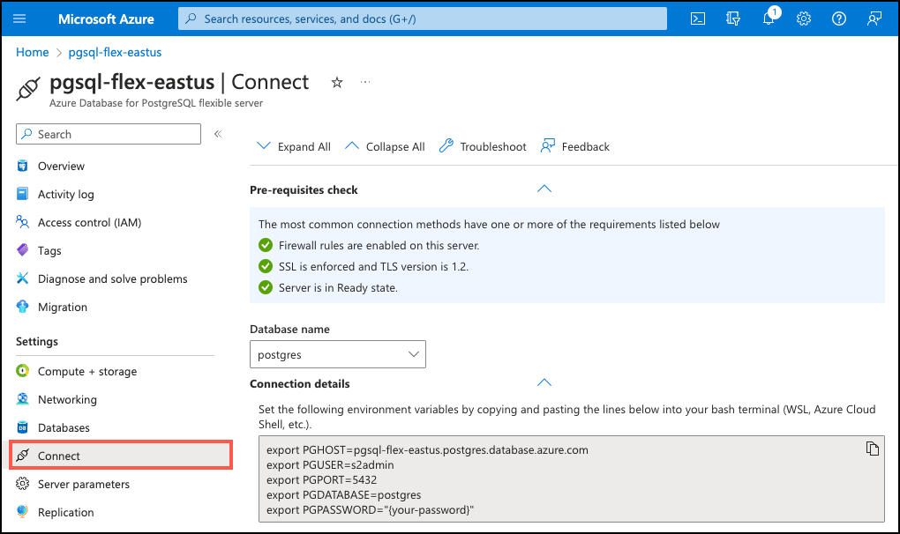
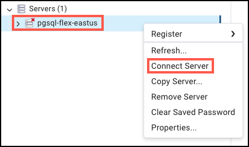
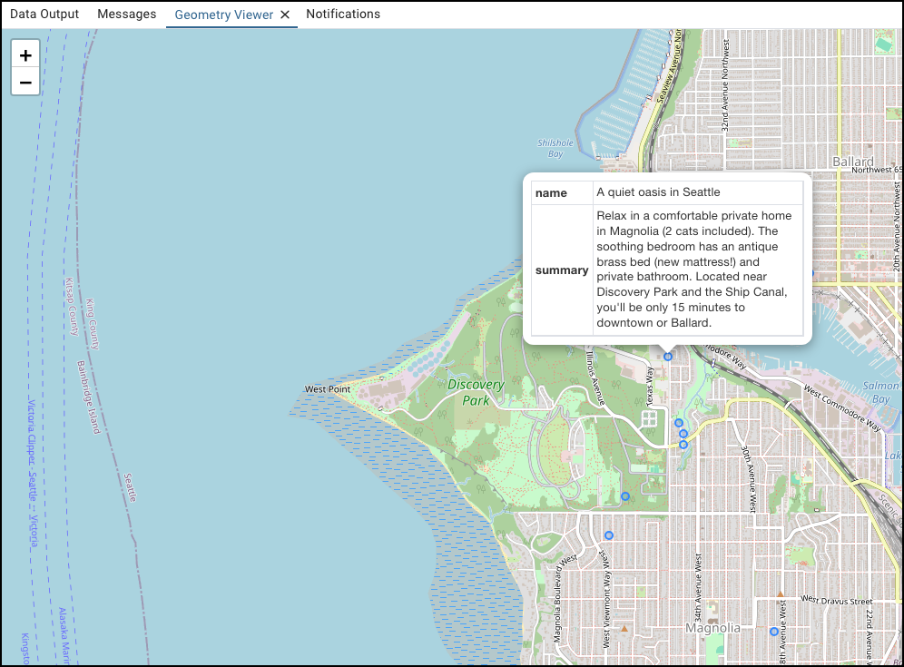
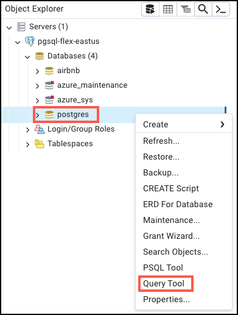

# Hands-on Lab: Working with common PostgreSQL extensions

- [Hands-on Lab: Working with common PostgreSQL extensions](#hands-on-lab-working-with-common-postgresql-extensions)
  - [Exercise 1: Load sample data into your database](#exercise-1-load-sample-data-into-your-database)
    - [Task 1: Connect to the database using psql in the Azure Cloud Shell](#task-1-connect-to-the-database-using-psql-in-the-azure-cloud-shell)
    - [Task 2: Create a new database schema and tables](#task-2-create-a-new-database-schema-and-tables)
    - [Task 3: Load CSV data into tables](#task-3-load-csv-data-into-tables)
  - [Exercise 2: Add extensions to allowlist](#exercise-2-add-extensions-to-allowlist)
  - [Exercise 3: Store geospatial data with the PostGIS extension](#exercise-3-store-geospatial-data-with-the-postgis-extension)
    - [Task 1: Connect to the database using pgAdmin](#task-1-connect-to-the-database-using-pgadmin)
    - [Task 2: Install the PostGIS extension](#task-2-install-the-postgis-extension)
    - [Task 3: Add a geospatial column to the listings table](#task-3-add-a-geospatial-column-to-the-listings-table)
    - [Task 4: View geospatial query results with the geometry data viewer](#task-4-view-geospatial-query-results-with-the-geometry-data-viewer)
  - [Exercise 4: Set up scheduled jobs](#exercise-4-set-up-scheduled-jobs)
    - [Task 1: Install pg\_cron extension](#task-1-install-pg_cron-extension)
    - [Task 2: Create a scheduled task using pg\_cron](#task-2-create-a-scheduled-task-using-pg_cron)
  - [Summary](#summary)

Azure Database for PostgreSQL Flexible Server is an extensible platform that provides the ability to extend a database's functionality using [many popular PostgreSQL extensions](https://learn.microsoft.com/azure/postgresql/flexible-server/concepts-extensions#extension-versions). Extensions allow you to add extra functionality to your database by adding and extending the capabilities of processes within the database. They work by bundling multiple related SQL objects in a single package that can be loaded or removed from your database with a single command. After being loaded into the database, extensions function like built-in features.

You can view the list of supported extensions by running `SHOW azure.extensions;` within the database. Note that extensions not listed are not currently supported on Azure Database for PostgreSQL flexible server. You cannot create or load your own extension in Azure Database for the PostgreSQL flexible server.

> Important
>
> This lab relies on the Azure Database for PostgreSQL Flexible Server database created in **Hands-on Lab 1: Provisioning, configuring, and getting started with development**.

In this lab, you work with the following common PostgreSQL extensions:

| Extension | Description |
| --------- | ----------- |
| [postgis](https://www.postgis.net/) | Adds support for storing, indexing, and querying geospatial data (geometry, geography). |
| [pg_cron](https://github.com/citusdata/pg_cron) | A cron-based job scheduler that allows you to schedule PostgreSQL commands directly from the database. |

## Exercise 1: Load sample data into your database

Before exploring the power of extensions, you need to populate your database with some sample data. In this exercise, you will connect to your database using the [psql command-line utility](https://www.postgresql.org/docs/current/app-psql.html), create a new schema and a few tables for hosting data, then use the `COPY` command to load data into those tables from a public blob storage account.

### Task 1: Connect to the database using psql in the Azure Cloud Shell

In this task, you use the `psql` command line utility to connect to your database from the [Azure Cloud Shell](https://learn.microsoft.com/azure/cloud-shell/overview).

1. You need the connection details for your database to connect to it using `psql` in the Cloud Shell. Navigate to your Azure Database for PostgreSQL Flexible Server resource in the [Azure portal](https://portal.azure.com/), and in the left-hand navigation menu, select **Connect** under **Settings**.

    

2. With the **Connect** page open, select the **Cloud Shell** icon in the Azure portal toolbar to open a new [Cloud Shell](https://learn.microsoft.com/azure/cloud-shell/overview) pane at the bottom of your browser window.

    

3. From the database's **Connect** page in the Azure portal, select **airbnb** for the **Database name**, then copy the **Connection details** block and paste it into the Cloud Shell.

    

4. At the Cloud Shell prompt, replace the `{your_password}` token with the password you assigned to the `s2admin` user when creating your database, then run the command. If you followed the instructions in Lab 1, the password should be `Seattle123Seattle123`.

5. Connect to your database using the `psql` by entering the following at the prompt:

    ```bash
    psql
    ```

    Connecting to the database from the Cloud Shell requires that the `Allow public access from any Azure service within Azure to the server` box is checked on the **Networking** page of the database. If you receive a message that you are unable to connect, please verify this is checked and try again.

### Task 2: Create a new database schema and tables

For this lab, you will use a small sample of Seattle Airbnb listing data, which you will access from a public storage account. The sample data consists of three CSV files, `calendar.csv`, `listings.csv`, and `reviews.csv`. In this task, you will create a new schema named `abb` in your database, then add three tables to that schema to host the sample data.

It is important to note that when loading data from CSV files into tables using the `COPY` command, the table structure and column data types must align precisely with the data in the CSV file to avoid errors.

1. To host the tables, you will create a new schema named `abb` in the database. To make a new schema, use the following command:

    ```sql
    CREATE SCHEMA IF NOT EXISTS abb;
    ```

2. Before importing data, you must create tables to store data from the CSV files. Run the command below to build a table named `calendar` in the `abb` schema for hosting the data in the `calendar.csv` file. The table structure is based on the columns defined in each file.

    ```sql
    CREATE TABLE abb.calendar
    (
        listing_id bigint,
        date date,
        available boolean,
        price text
    );
    ```

    Observe that the `price` column on the `calendar` table above is assigned a `text` data type in the table. This data type assignment is necessary because the CSV file you will use to load data into the table contains dollar signs (`$`) and commas (`,`) in some values. You will correct this below to allow numeric operations to occur on the field.

3. Next, create a table named `listings` in the `abb` schema for hosting the data in the `listings.csv` file.

    ```sql
    CREATE TABLE abb.listings
    (
        id bigint PRIMARY KEY,
        listing_url text,
        scrape_id bigint,
        last_scraped date,
        name text,
        summary text,
        space text,
        description text,
        experiences_offered text,
        neighborhood_overview text,
        notes text,
        transit text,
        thumbnail_url text,
        medium_url text,
        picture_url text,
        xl_picture_url text,
        host_id bigint,
        host_url text,
        host_name text,
        host_since date,
        host_location text,
        host_about text,
        host_response_time text,
        host_response_rate text,
        host_acceptance_rate text,
        host_is_superhost boolean,
        host_thumbnail_url text,
        host_picture_url text,
        host_neighbourhood text,
        host_listings_count int,
        host_total_listings_count int,
        host_verifications text,
        host_has_profile_pic boolean,
        host_identity_verified boolean,
        street text,
        neighbourhood text,
        neighbourhood_cleansed text,
        neighbourhood_group_cleansed text,
        city text,
        state text,
        zipcode text,
        market text,
        smart_location text,
        country_code text,
        country text,
        latitude float,
        longitude float,
        is_location_exact boolean,
        property_type text,
        room_type text,
        accommodates int,
        bathrooms real,
        bedrooms int,
        beds int,
        bed_type text,
        amenities text,
        square_feet int,
        price text,
        weekly_price text,
        monthly_price text,
        security_deposit text,
        cleaning_fee text,
        guests_included int,
        extra_people text,
        minimum_nights int,
        maximum_nights int,
        calendar_updated text,
        has_availability boolean,
        availability_30 int,
        availability_60 int,
        availability_90 int,
        availability_365 int,
        calendar_last_scraped date,
        number_of_reviews int,
        first_review date,
        last_review date,
        review_scores_rating int,
        review_scores_accuracy int,
        review_scores_cleanliness int,
        review_scores_checkin int,
        review_scores_communication int,
        review_scores_location int,
        review_scores_value int,
        requires_license boolean,
        license text,
        jurisdiction_names text,
        instant_bookable boolean,
        cancellation_policy text,
        require_guest_profile_picture boolean,
        require_guest_phone_verification boolean,
        calculated_host_listings_count int,
        reviews_per_month numeric
    );
    ```

4. Finally, create a `reviews` table in the `abb` schema for data in the `reviews.csv` file.

    ```sql
    CREATE TABLE abb.reviews
    (
        listing_id bigint,
        id bigint PRIMARY KEY,
        date date,
        reviewer_id bigint,
        reviewer_name text,
        comments text
    );
    ```

### Task 3: Load CSV data into tables

You can now load the tables with sample data with your new schema and tables. In this task, you use the `COPY` command to perform a one-time bulk load of the sample Airbnb data into your new tables in the `abb` schema.

1. Before using the `COPY` command to load data from CSV files, set the database's `CLIENT_ENCODING` to **utf8** to ensure the CSV files are read correctly.

    ```sql
    SET CLIENT_ENCODING TO 'utf8';
    ```

2. Run the command below to load data into the `calendar` table in the `abb` schema:

    ```sql
    \COPY abb.calendar FROM PROGRAM 'curl https://solliancepublicdata.blob.core.windows.net/ms-postgresql-labs/calendar.csv' WITH CSV HEADER
    ```

    In the `COPY` command issued, the `FROM PROGRAM` clause informs the `psql` to retrieve the data file from an application, in this case, `curl`. The `WITH CSV HEADER` option provides information about the format and structure of the ingested file.

    When the command is finished, you should see output stating how many rows the COPY command ingested into the table, similar to the following:

    ```sql
    COPY 1393570
    ```

3. Next, execute a simple query against the table to verify the data loaded into it. A typical query pattern when searching for an available Airbnb listing involves including a price range in their search. Run the following query to look for listings available for the week of January 13, 2016, which are in the price range of $100 to $125 per night.

    ```sql
    SELECT * FROM abb.calendar
    WHERE date = '2016-01-13'
    AND available = true
    AND price BETWEEN 100 AND 125
    LIMIT 10;
    ```

    **IMPORTANT**: The above query is expected to fail. Recall that the `price` column on the `calendar` table you created above was assigned a `text` data type in the table to allow the CSV file data to be loaded without error due to that column containing dollar signs (`$`) and commas (`,`) in some values. Because the `BETWEEN` operator expects numeric values, attempting the query for listings within a given price range results in the error below:

    ```sql
    ERROR:  operator does not exist: text >= integer
    LINE 1: SELECT * FROM abb.calendar WHERE price BETWEEN 100 AND 125 L...
    ```

4. After completing the calendar data import, you can now remove non-numeric characters from the column and fix the data type associated with the `price` column. This change will allow numeric operations to be performed on the column.

    ```sql
    ALTER TABLE abb.calendar ALTER column price TYPE numeric USING (REPLACE(REPLACE(price, ',', ''), '$', '')::numeric);
    ```

5. Now, run the `SELECT` query again and observe the results:

    ```sql
    SELECT * FROM abb.calendar
    WHERE date = '2016-01-13'
    AND available = true
    AND price BETWEEN 100 AND 125
    LIMIT 10;
    ```

    With the `price` column now represented as a numeric value, the query should run successfully with output similar to the following:

    ```sql
     listing_id |    date    | available | price  
    ------------+------------+-----------+--------
         953595 | 2016-01-13 | t         | 125.00
        9218403 | 2016-01-13 | t         | 110.00
        7680289 | 2016-01-13 | t         | 125.00
        8515408 | 2016-01-13 | t         | 110.00
        1148517 | 2016-01-13 | t         | 115.00
        4085439 | 2016-01-13 | t         | 125.00
        2686374 | 2016-01-13 | t         | 125.00
        6590264 | 2016-01-13 | t         | 100.00
        4317390 | 2016-01-13 | t         | 121.00
        3053237 | 2016-01-13 | t         | 104.00
    ```

6. Next, run the below command to load data into the `listing` table:

    ````sql
    \COPY abb.listings FROM PROGRAM 'curl https://solliancepublicdata.blob.core.windows.net/ms-postgresql-labs/listings.csv' WITH CSV HEADER
    ```

7. Run the following query to verify the data is loaded correctly.

    ```sql
    SELECT COUNT(id) FROM abb.listings WHERE neighbourhood_group_cleansed = 'Ballard';
    ```

8. Finally, load the `reviews` tables in the `abb` schema with data from the `reviews.csv` file.

    ```sql
    \COPY abb.reviews FROM PROGRAM 'curl https://solliancepublicdata.blob.core.windows.net/ms-postgresql-labs/reviews.csv' WITH CSV HEADER
    ````

9. Query the `reviews` table to verify the data loaded. By running the `\x auto` command below before executing the last query, you enable the extended display to be automatically applied when necessary to make the output from the command easier to view in the Azure Cloud Shell. This functionality is useful for tables with wide column values, such as the `reviews` table.

    ```sql
    \x auto
    ```

    ```sql
    SELECT listing_id, date, reviewer_name, comments FROM abb.reviews WHERE listing_id = 7202016 LIMIT 3;
    ```

## Exercise 2: Add extensions to allowlist

Before you can install and use extensions in an Azure Database for PostgreSQL Flexible Server, you must _allowlist_ the desired extensions, as described in [how to use PostgreSQL extensions](https://learn.microsoft.com/azure/postgresql/flexible-server/concepts-extensions#how-to-use-postgresql-extensions).

1. In a web browser, navigate to your Azure Database for PostgreSQL Flexible Server resource in the [Azure portal](https://portal.azure.com/).

2. From the database's left-hand navigation menu, select **Server parameters** under **Settings**, then enter `azure.extensions` into the search box. Expand the **VALUE** dropdown list, then locate and check the box next to each of the following extensions:

    - PG_CRON
    - POSTGIS

    

    If the extension you are attempting to allowlist is not present in the list, it may not be supported in the version of PostgreSQL you are using. You can review the [supported extension versions in the Microsoft docs](https://learn.microsoft.com/azure/postgresql/flexible-server/concepts-extensions#extension-versions). Alternatively, you can run the query, `SELECT * FROM pg_available_extensions;`, against your database.

3. Some extensions must also be included in the server's shared preloaded libraries. Of the extensions you use in this lab, `pg_cron` needs to be preloaded at the server start. Clear the search box on the **Server parameters** page and enter `shared_preload`. Expand the **VALUE** dropdown list, then locate the `PG_CRON` extension and ensure it is checked. This extension is preloaded by default, so you are verifying its state and should not have to make any changes.

    

4. Select **Save** on the toolbar to save the updates to the Azure extensions allowlist. This action will trigger a deployment on your database that should be completed within 20 to 30 seconds.

## Exercise 3: Store geospatial data with the PostGIS extension

[PostGIS](https://www.postgis.net/) is a 3rd party open-source spatial database extender for PostgreSQL object-relational databases, which adds support for geographic objects that allow location queries to be run in SQL. This extension enables complex geospatial queries and analysis within PostgreSQL, essential for mapping, location tracking, and spatial analysis. It provides a variety of spatial data types, indexing options, and functions to query and manipulate geospatial data efficiently.

You will use [pgAdmin](https://www.pgadmin.org/docs/pgadmin4/latest/index.html) to connect to and execute queries against your database for this exercise. The pgAdmin tool offers a [Geometry Data Viewer](https://www.pgadmin.org/docs/pgadmin4/8.0/editgrid.html#the-data-grid), which allows you to view GIS objects on a map.

### Task 1: Connect to the database using pgAdmin

In Lab 1, you downloaded and installed [pgAdmin](https://www.pgadmin.org/download/) and registered a connection to your database server. In this task, you will open pgAdmin and connect to your database.

> Note: you configured pgAdmin to connect to your server in Lab 1. If necessary, refer back to those steps to register your database server and establish a connection to your database.

1. Open **pgAdmin** on your local or lab virtual machine.

2. Expand the **Servers** node within the Object Explorer, select your database server from the list, then right-click the server and select **Connect Server** from the context menu.

    
  
3. Once connected to your server, expand the **Databases** node and select the **airbnb** database. Right-click the **airbnb** database and select **Query Tool** from the context menu.

    

### Task 2: Install the PostGIS extension

To install the `postgis` extension in your database, you will use the [CREATE EXTENSION](https://www.postgresql.org/docs/current/static/sql-createextension.html) command, as you did with the `pg_azure_storage` extension. Behind the scenes, executing `CREATE EXTENSION` runs the extension's script file. The script typically creates new SQL objects such as functions, data types, operators, and index support methods. Additionally, `CREATE EXTENSION` records the identities of all the created objects so they can be dropped again if `DROP EXTENSION` is issued.

1. In the query window you opened above, run the `CREATE EXTENSION` command to install the `postgis` extension in your database.

    ```sql
    CREATE EXTENSION IF NOT EXISTS postgis;
    ```

    If you attempt to install an extension with the same name as one already loaded in the database, you will receive an error that the extension already exists. Specifying the `IF NOT EXISTS` clause when running the `CREATE EXTENSION` command allows you to avoid this error.

### Task 3: Add a geospatial column to the listings table

With the `PostGIS` extension now loaded, you are ready to begin working with geospatial data in the database. The `listings` table you created and populated above contains the latitude and longitude of all listed properties. To use these data for geospatial analysis, you must alter the `listings` table to add a `geometry` column that accepts the `point` data type. These new data types are included in the `postgis` extension.

1. To accommodate `point` data, add a new `geometry` column to the table that accepts `point` data. Copy and paste the following query into the open pgAdmin query window:

    ```sql
    ALTER TABLE abb.listings
    ADD COLUMN listing_location geometry(point, 4326);
    ```

2. Next, update the table with geospatial data associated with each listing by adding the longitude and latitude values into the `geometry` column.

    ```sql
    UPDATE abb.listings
    SET listing_location = ST_SetSRID(ST_Point(longitude, latitude), 4326);
    ```

### Task 4: View geospatial query results with the geometry data viewer

With `PostGIS` installed in your database, you can take advantage of the [Geometry Data Viewer](https://www.pgadmin.org/docs/pgadmin4/8.0/editgrid.html#the-data-grid) in pgAdmin to view GIS objects in a map.

1. Copy and paste the following query into the open query editor, then run it to view the data stored in the `listing_location` column:

    ```sql
    SELECT name, listing_location FROM abb.listings LIMIT 50;
    ```

2. In the **Data Output** panel, select the **View all geometries in this column** button displayed in the `listing_location` column of the query results.

    

    The **View all geometries in this column** button opens the **Geometry Viewer**, allowing you to view the query results on a map.

3. Select one of the points displayed on the map to view details about the location. In this case, the query only provided the name of the property.

    

4. Now, run the following query to perform a geospatial proximity query, returning properties that are available for the week of January 13, 2016, are under $75.00 per night, and are within a short distance of Discovery Park in Seattle. The query uses the [ST_DWithin](https://postgis.net/docs/ST_DWithin.html) function provided by the `PostGIS` extension to identify listings within a given distance from the park, which has a longitude of `-122.410347` and a latitude of `47.655598`.

    ```sql
    SELECT name, listing_location, summary
    FROM abb.listings l
    INNER JOIN abb.calendar c ON l.id = c.listing_id
    WHERE ST_DWithin(
        listing_location,
        ST_GeomFromText('POINT(-122.410347 47.655598)', 4326),
        0.025
    )
    AND c.date = '2016-01-13'
    AND c.available = true
    AND c.price <= 75.00;
    ```

5. Select the **View all geometries in this column** button displayed in the `listing_location` column of the query results to open the **Geometry Viewer** and examine the results.

    

## Exercise 4: Set up scheduled jobs

The following extension you will work with is [pg_cron](https://github.com/citusdata/pg_cron), a simple, cron-based job scheduler for PostgreSQL that runs inside the database as an extension. This powerful and simple extension can be used for many tasks, including aggregating data in near-real time, database cleanup and administrative tasks, and much more.

Extending your database with the [pg_cron](https://github.com/citusdata/pg_cron) extension allows you to schedule PostgreSQL commands directly from the database using a cron-based job scheduler. Using this extension, you can schedule a job that calls a function to execute on a schedule, such as every month, hour, or minute. In this exercise, you will create a scheduled task that runs the `VACUUM` operation against the `airbnb` database.

### Task 1: Install pg_cron extension

The `pg_cron` extension works slightly differently than the extensions you worked with above. It can only be installed in the `postgres` database, which requires access to the background worker process to schedule jobs. To install the `pg_cron` extension, you will open a new **pgAdmin** query window from the `postgres` database.

1. In your open **pgAdmin** session, locate the `postgres` databases under the **Databases** node in the Object Explore, then right-click the database and select **Query Tool** from the context menu.

    

2. In the new query panel, run the `CREATE EXTENSION` command to install the `pg_cron` extension in the `postgres` database.

    ```sql
    CREATE EXTENSION IF NOT EXISTS pg_cron;
    ```

### Task 2: Create a scheduled task using pg_cron

In this task, you will use `pg_cron` to create a scheduled job for performing garbage collection in the `airbnb` database using the [VACUUM](https://www.postgresql.org/docs/current/sql-vacuum.html) operation.

1. Copy and paste the following query into the query window for the `postgres` database, then run it to schedule a `VACUUM` operation in the `airbnb` database every five minutes.

    ```sql
    SELECT cron.schedule_in_database('VACUUM','*/5 * * * * ','VACUUM','airbnb');
    ```

2. Run the following query to view the job list, including the one you just added.

    ```sql
    SELECT * FROM cron.job;
    ```

    

    If you need to stop a job, you must retrieve the `jobid` for your job using this query.

3. To unschedule the job, use the following, replacing the `{job_id}` token with the `jobid` you retrieved from the previous query.

    ```sql
    SELECT cron.unschedule({job_id});
    ```

## Summary

Congratulations! You have completed the **Working with common PostgreSQL extensions** hands-on lab. In this lab, you explored the powerful extensibility of Azure Database for PostgreSQL Flexible Server by installing and using some common PostgreSQL extensions.

In the next lab, you will continue exploring these capabilities, looking at how you can extend the database to add the power of generative AI and Large Language Models.
