# Hands-on Lab: Working with common PostgreSQL extensions

- [Hands-on Lab: Working with common PostgreSQL extensions](#hands-on-lab-working-with-common-postgresql-extensions)
  - [Prerequisites](#prerequisites)
    - [Task 1: Provision an Azure Database for PostgreSQL Flexible Server](#task-1-provision-an-azure-database-for-postgresql-flexible-server)
    - [Task 2: Connect to the database using psql in the Azure Cloud Shell](#task-2-connect-to-the-database-using-psql-in-the-azure-cloud-shell)
    - [Task 3: Add data to the database](#task-3-add-data-to-the-database)
  - [Exercise 1: Add extensions to allowlist](#exercise-1-add-extensions-to-allowlist)
  - [Exercise 2: Store geospatial data with the PostGIS extension](#exercise-2-store-geospatial-data-with-the-postgis-extension)
    - [Task 1: Connect to the database using pgAdmin](#task-1-connect-to-the-database-using-pgadmin)
    - [Task 2: Install the PostGIS extension](#task-2-install-the-postgis-extension)
    - [Task 3: Add a geospatial column to the listings table](#task-3-add-a-geospatial-column-to-the-listings-table)
    - [Task 4: View geospatial query results with the geometry data viewer](#task-4-view-geospatial-query-results-with-the-geometry-data-viewer)
  - [Exercise 3: Set up scheduled jobs](#exercise-3-set-up-scheduled-jobs)
    - [Task 1: Install pg\_cron extension](#task-1-install-pg_cron-extension)
    - [Task 2: Create a scheduled task using pg\_cron](#task-2-create-a-scheduled-task-using-pg_cron)
  - [Exercise 4: Load data into the database from Azure storage using the Azure Storage extension (Optional)](#exercise-4-load-data-into-the-database-from-azure-storage-using-the-azure-storage-extension-optional)
    - [Task 1: Add extension to allowlist](#task-1-add-extension-to-allowlist)
    - [Task 2: Create an Azure Blob Storage account](#task-2-create-an-azure-blob-storage-account)
    - [Task 3: Create a container](#task-3-create-a-container)
    - [Task 4: Upload data files](#task-4-upload-data-files)
    - [Task 5: Connect to the database using psql in the Azure Cloud Shell](#task-5-connect-to-the-database-using-psql-in-the-azure-cloud-shell)
    - [Task 6: Enable and configure the pg\_azure\_storage extension](#task-6-enable-and-configure-the-pg_azure_storage-extension)
    - [Task 7: Import data from blob storage](#task-7-import-data-from-blob-storage)
    - [Task 8: Export data into blob storage using the blob\_put function](#task-8-export-data-into-blob-storage-using-the-blob_put-function)
  - [Summary](#summary)

Azure Database for PostgreSQL Flexible Server is an extensible platform that provides the ability to extend a database's functionality using [many popular PostgreSQL extensions](https://learn.microsoft.com/azure/postgresql/flexible-server/concepts-extensions#extension-versions). Extensions allow you to add extra functionality to your database by adding and expanding the capabilities of processes within the database. They work by bundling multiple related SQL objects in a single package that can be loaded or removed from your database with a single command. After being loaded into the database, extensions function like built-in features.

You can view the list of supported extensions by running `SHOW azure.extensions;` within the database. Note that extensions not listed are not currently supported on Azure Database for PostgreSQL flexible server. You cannot create or load your own extension in Azure Database for the PostgreSQL flexible server.

In this lab, you work with the following common PostgreSQL extensions:

| Extension | Description |
| --------- | ----------- |
| [postgis](https://www.postgis.net/) | Adds support for storing, indexing, and querying geospatial data (geometry, geography). |
| [pg_cron](https://github.com/citusdata/pg_cron) | A cron-based job scheduler that allows you to schedule PostgreSQL commands directly from the database. |
| [pg_azure_storage](https://learn.microsoft.com/azure/postgresql/flexible-server/reference-pg-azure-storage) (Optional) | Allows for importing and exporting data in multiple file formats directly between Azure blob storage and an Azure Database for PostgreSQL Flexible Server database. |

## Prerequisites

This lab uses the Azure Database for PostgreSQL instance created in Lab 1 and the data and tables created in Lab 2. If you are starting this lab without completing the previous labs, expand the section below and complete the steps to set up your database.

<details>
<summary>Expand this section to view the prerequisite setup steps.</summary>

### Task 1: Provision an Azure Database for PostgreSQL Flexible Server

1. In a web browser, navigate to the [Azure portal](https://portal.azure.com/).

2. select the **Cloud Shell** icon in the Azure portal toolbar to open a new [Cloud Shell](https://learn.microsoft.com/azure/cloud-shell/overview) pane at the bottom of your browser window.

    

3. At the cloud shell prompt, run the following commands to define variables for creating resources. The variables represent the names to assign to your resource group and database and specify the Azure region into which resources should be deployed.

    The resource group name specified is `rg-postgresql-labs`, but you can provide any name you wish to use to host the resources associated with this lab.

    ```bash
    RG_NAME=rg-postgresql-labs
    ```

    In the database name, replace the `{SUFFIX}` token with a unique value, such as your initials, to ensure the database server name is globally unique.

    ```bash
    DATABASE_NAME=pgsql-flex-{SUFFIX}
    ```

    Replace the region with whatever location you want to use for lab resources.

    ```bash
    REGION=eastus
    ```

4. Run the following Azure CLI command to create a resource group, specifying the location. If you have more than one Azure subscription, use the `az account set --subscription <subscription id>` command first to select the subscription you want to use for lab resources.

    ```bash
    az group create --name $RG_NAME --location $REGION
    ```

5. Provision an Azure Database for PostgreSQL database instance within the resource group you created above by running the following Azure CLI command:

    ```bash
    az postgres flexible-server create --name $DATABASE_NAME --location $REGION --resource-group $RG_NAME \
        --admin-user s2admin --admin-password Seattle123Seattle123 --database-name airbnb \
        --public-access 0.0.0.0-255.255.255.255 --version 16 \
        --sku-name Standard_D2ds_v5 --storage-size 32 --yes
    ```

### Task 2: Connect to the database using psql in the Azure Cloud Shell

In this task, you use the [psql command-line utility](https://www.postgresql.org/docs/current/app-psql.html) from the [Azure Cloud Shell](https://learn.microsoft.com/azure/cloud-shell/overview) to connect to your database.

1. You need the connection details for your database to connect to it using `psql` in the Cloud Shell. Using the open [Azure portal](https://portal.azure.com/) window with the cloud shell pane at the bottom, navigate to your Azure Database for PostgreSQL Flexible Server resource, and in the left-hand navigation menu, select **Connect** under **Settings**.

    

2. From the database's **Connect** page in the Azure portal, select **airbnb** for the **Database name**, then copy the **Connection details** block and paste it into the Cloud Shell.

    

3. At the Cloud Shell prompt, replace the `{your_password}` token with the password you assigned to the `s2admin` user when creating your database, then run the command. If you followed the instructions in Lab 1, the password should be `Seattle123Seattle123`.

4. Connect to your database using the `psql` command-line utility by entering the following at the prompt:

    ```bash
    psql
    ```

    Connecting to the database from the Cloud Shell requires that the `Allow public access from any Azure service within Azure to the server` box is checked on the **Networking** page of the database. If you receive a message that you are unable to connect, please verify this is checked and try again.

### Task 3: Add data to the database

Using the `psql` command prompt, you will create tables and populate them with data for use in the lab.

1. Run the following commands to create temporary tables for importing JSON data from a public blob storage account.

    ```sql
    CREATE TABLE temp_calendar (data jsonb);
    CREATE TABLE temp_listings (data jsonb);
    CREATE TABLE temp_reviews (data jsonb);
    ```

2. Using the `COPY` command, populate each temporary table with data from JSON files in a public storage account.

    ```sql
    \COPY temp_calendar (data) FROM PROGRAM 'curl https://solliancepublicdata.blob.core.windows.net/ms-postgresql-labs/calendar.json'
    ```

    ```sql
    \COPY temp_listings (data) FROM PROGRAM 'curl https://solliancepublicdata.blob.core.windows.net/ms-postgresql-labs/listings.json'
    ```

    ```sql
    \COPY temp_reviews (data) FROM PROGRAM 'curl https://solliancepublicdata.blob.core.windows.net/ms-postgresql-labs/reviews.json'
    ```

3. Run the following command to create the tables for storing data in the shape used by this lab:

    ```sql
    CREATE TABLE listings (
        listing_id int,
        name varchar(50),
        street varchar(50),
        city varchar(50),
        state varchar(50),
        country varchar(50),
        zipcode varchar(50),
        bathrooms int,
        bedrooms int,
        latitude decimal(10,5), 
        longitude decimal(10,5), 
        summary varchar(2000),
        description varchar(2000),
        host_id varchar(2000),
        host_url varchar(2000),
        listing_url varchar(2000),
        room_type varchar(2000),
        amenities jsonb,
        host_verifications jsonb,
        data jsonb
    );
    ```

    ```sql
    CREATE TABLE reviews (
        id int, 
        listing_id int, 
        reviewer_id int, 
        reviewer_name varchar(50), 
        date date,
        comments varchar(2000)
    );
    ```

    ```sql
    CREATE TABLE calendar (
        listing_id int, 
        date date,
        price decimal(10,2), 
        available boolean
    );
    ```

4. Finally, run the following `INSERT INTO` statements to load data from the temporary tables to the main tables, extracting data from the JSON `data` field into individual columns:

    ```sql
    INSERT INTO listings
    SELECT 
        data['id']::int, 
        replace(data['name']::varchar(50), '"', ''),
        replace(data['street']::varchar(50), '"', ''),
        replace(data['city']::varchar(50), '"', ''),
        replace(data['state']::varchar(50), '"', ''),
        replace(data['country']::varchar(50), '"', ''),
        replace(data['zipcode']::varchar(50), '"', ''),
        data['bathrooms']::int,
        data['bedrooms']::int,
        data['latitude']::decimal(10,5),
        data['longitude']::decimal(10,5),
        replace(data['description']::varchar(2000), '"', ''),        
        replace(data['summary']::varchar(2000), '"', ''),        
        replace(data['host_id']::varchar(50), '"', ''),
        replace(data['host_url']::varchar(50), '"', ''),
        replace(data['listing_url']::varchar(50), '"', ''),
        replace(data['room_type']::varchar(50), '"', ''),
        data['amenities']::jsonb,
        data['host_verifications']::jsonb,
        data::jsonb
    FROM temp_listings;
    ```

    ```sql
    INSERT INTO reviews
    SELECT 
        data['id']::int,
        data['listing_id']::int,
        data['reviewer_id']::int,
        replace(data['reviewer_name']::varchar(50), '"', ''), 
        to_date(replace(data['date']::varchar(50), '"', ''), 'YYYY-MM-DD'),
        replace(data['comments']::varchar(2000), '"', '')
    FROM temp_reviews;
    ```

    ```sql
    INSERT INTO calendar
    SELECT 
        data['listing_id']::int,
        to_date(replace(data['date']::varchar(50), '"', ''), 'YYYY-MM-DD'),
        data['price']::decimal(10,2),
        replace(data['available']::varchar(50), '"', '')::boolean
    FROM temp_calendar;
    ```

    You are now ready to begin Lab 3!

</details>

## Exercise 1: Add extensions to allowlist

Before you can install and use extensions in an Azure Database for PostgreSQL Flexible Server, you must _allowlist_ the desired extensions, as described in [how to use PostgreSQL extensions](https://learn.microsoft.com/azure/postgresql/flexible-server/concepts-extensions#how-to-use-postgresql-extensions).

1. In a web browser, navigate to your Azure Database for PostgreSQL Flexible Server resource in the [Azure portal](https://portal.azure.com/).

2. From the database's left-hand navigation menu, select **Server parameters** under **Settings**, then enter `azure.extensions` into the search box. Expand the **VALUE** dropdown list, then locate and check the box next to each of the following extensions:

    - PG_CRON
    - POSTGIS

    

    If the extension you are attempting to allowlist is not present in the list, it may not be supported in the version of PostgreSQL you are using. You can review the [supported extension versions in the Microsoft docs](https://learn.microsoft.com/azure/postgresql/flexible-server/concepts-extensions#extension-versions). Alternatively, you can run the query, `SELECT * FROM pg_available_extensions;`, against your database.

3. Some extensions must be included in the server's shared preloaded libraries. Of the extensions you use in this lab, `pg_cron` must be preloaded at the server start. Clear the search box on the **Server parameters** page and enter `shared_preload`. Expand the **VALUE** dropdown list, then locate the `PG_CRON` extension and ensure it is checked. This extension is preloaded by default, so you are verifying its state and should not have to make any changes.

    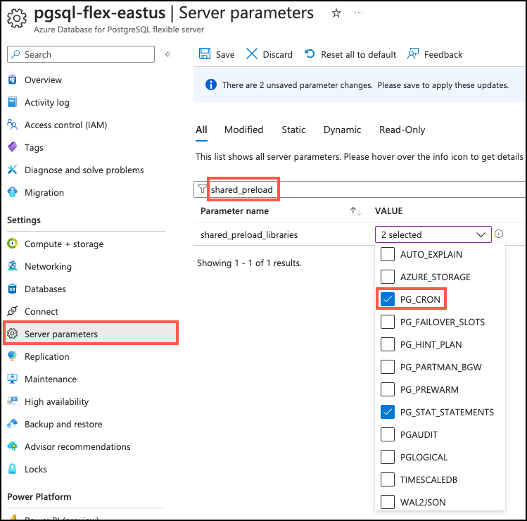

4. Select **Save** on the toolbar to save the updates to the Azure extensions allowlist. This action will trigger a deployment on your database that should be completed within 20 to 30 seconds.

## Exercise 2: Store geospatial data with the PostGIS extension

[PostGIS](https://www.postgis.net/) is a 3rd party open-source spatial database extender for PostgreSQL object-relational databases, which adds support for geographic objects that allow location queries to be run in SQL. This extension enables complex geospatial queries and analysis within PostgreSQL, essential for mapping, location tracking, and spatial analysis. It provides a variety of spatial data types, indexing options, and functions to query and manipulate geospatial data efficiently.

You will use [pgAdmin](https://www.pgadmin.org/docs/pgadmin4/latest/index.html) to connect to and execute queries against your database for this exercise. The pgAdmin tool offers a [Geometry Data Viewer](https://www.pgadmin.org/docs/pgadmin4/8.0/editgrid.html#the-data-grid), which allows you to view GIS objects on a map.

### Task 1: Connect to the database using pgAdmin

In this task, you will open pgAdmin and connect to your database.

1. If you do not already have it installed, download and install [pgAdmin](https://www.pgadmin.org/download/).

2. Open **pgAdmin** and, if you have not already done so, register your server by right-clicking **Servers** in the Object Explorer and selecting **Register > Server**.

    **Note: you can skip this step if you registered the server in pgAdmin in a previous lab.**

    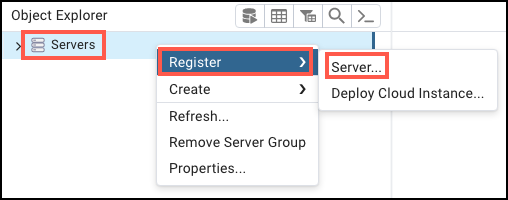

    Retrieve the server name of your Azure Database for PostgreSQL Flexible Server from the Azure portal.

    

    In the **Register - Server** dialog, paste your Azure Database for PostgreSQL Flexible Server server name into the **Name** field on the **General** tab.

    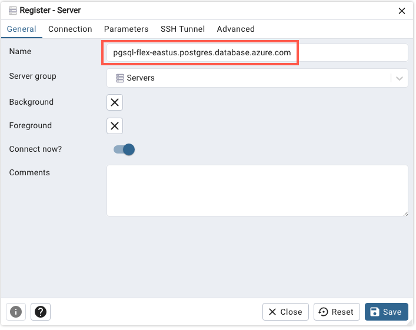

    Next, select the **Connection** tab and paste your server name into the **Hostname/address** field. Enter **s2admin** into the **Username** field, enter **Seattle123Seattle123** into the **Password** box, and optionally, select **Save password**.

    

    Finally, select the **Parameters** tab and set the **SSL mode** to **require**.

    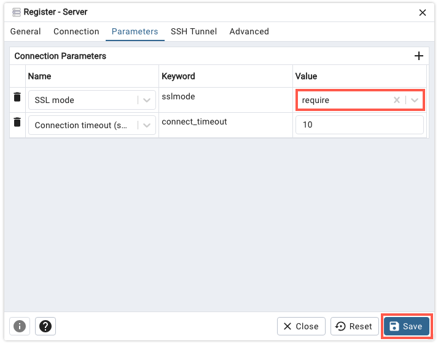

    Select **Save** to register your server.

3. Expand the **Servers** node within the Object Explorer, select your database server from the list, then right-click the server and select **Connect Server** from the context menu.

    
  
4. Once connected to your server, expand the **Databases** node and select the **airbnb** database. Right-click the **airbnb** database and select **Query Tool** from the context menu.

    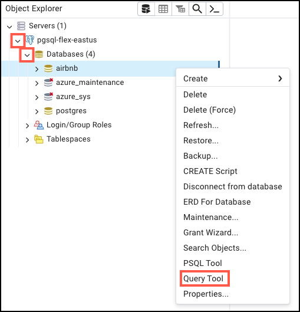

### Task 2: Install the PostGIS extension

To install the `postgis` extension in your database, you will use the [CREATE EXTENSION](https://www.postgresql.org/docs/current/static/sql-createextension.html) command. Behind the scenes, executing `CREATE EXTENSION` runs the extension's script file. The script typically creates new SQL objects such as functions, data types, operators, and index support methods. Additionally, `CREATE EXTENSION` records the identities of all the created objects so they can be dropped again if `DROP EXTENSION` is issued.

1. In the query window you opened above, run the `CREATE EXTENSION` command to install the `postgis` extension in your database.

    ```sql
    CREATE EXTENSION IF NOT EXISTS postgis;
    ```

    If you attempt to install an extension with the same name as one already loaded in the database, you will receive an error that the extension already exists. Specifying the `IF NOT EXISTS` clause when running the `CREATE EXTENSION` command allows you to avoid this error.

### Task 3: Add a geospatial column to the listings table

With the `PostGIS` extension now loaded, you are ready to begin working with geospatial data in the database. The `listings` table you created and populated above contains the latitude and longitude of all listed properties. To use these data for geospatial analysis, you must alter the `listings` table to add a `geometry` column that accepts the `point` data type. These new data types are included in the `postgis` extension.

1. To accommodate `point` data, add a new `geometry` column to the table that accepts `point` data. Copy and paste the following query into the open pgAdmin query window:

    ```sql
    ALTER TABLE listings
    ADD COLUMN listing_location geometry(point, 4326);
    ```

2. Next, update the table with geospatial data associated with each listing by adding the longitude and latitude values into the `geometry` column.

    ```sql
    UPDATE listings
    SET listing_location = ST_SetSRID(ST_Point(longitude, latitude), 4326);
    ```

### Task 4: View geospatial query results with the geometry data viewer

With `PostGIS` installed in your database, you can take advantage of the [Geometry Data Viewer](https://www.pgadmin.org/docs/pgadmin4/8.0/editgrid.html#the-data-grid) in pgAdmin to view GIS objects in a map.

1. Copy and paste the following query into the open query editor, then run it to view the data stored in the `listing_location` column:

    ```sql
    SELECT listing_id, name, listing_location FROM listings LIMIT 50;
    ```

2. In the **Data Output** panel, select the **View all geometries in this column** button displayed in the `listing_location` column of the query results.

    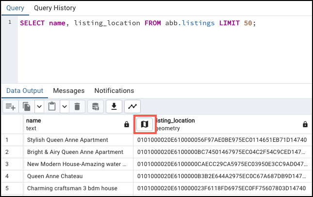

    The **View all geometries in this column** button opens the **Geometry Viewer**, allowing you to view the query results on a map.

3. Select one of the points displayed on the map to view details about the location. In this case, the query only provided the name of the property.

    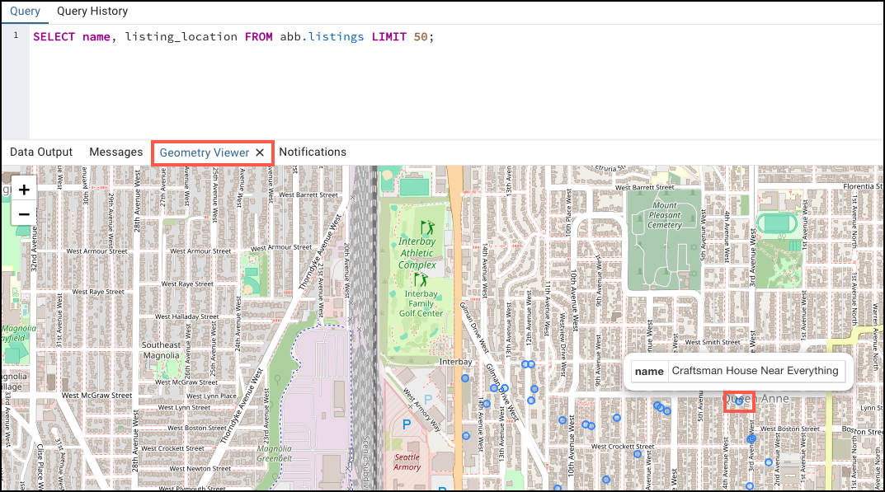

4. Now, run the following query to perform a geospatial proximity query, returning properties that are available for the week of January 13, 2016, are under $75.00 per night, and are within a short distance of Discovery Park in Seattle. The query uses the [ST_DWithin](https://postgis.net/docs/ST_DWithin.html) function provided by the `PostGIS` extension to identify listings within a given distance from the park, which has a longitude of `-122.410347` and a latitude of `47.655598`.

    ```sql
    SELECT name, listing_location, summary
    FROM listings l
    INNER JOIN calendar c ON l.listing_id = c.listing_id
    WHERE ST_DWithin(
        listing_location,
        ST_GeomFromText('POINT(-122.410347 47.655598)', 4326),
        0.025
    )
    AND c.date = '2016-01-13'
    AND c.available = 't'
    AND c.price <= 75.00;
    ```

5. Select the **View all geometries in this column** button displayed in the `listing_location` column of the query results to open the **Geometry Viewer** and examine the results.

    

## Exercise 3: Set up scheduled jobs

The following extension you will work with is [pg_cron](https://github.com/citusdata/pg_cron), a simple, cron-based job scheduler for PostgreSQL that runs inside the database as an extension. This powerful and simple extension can be used for many tasks, including aggregating data in near-real time, database cleanup and administrative tasks, and much more.

Extending your database with the [pg_cron](https://github.com/citusdata/pg_cron) extension allows you to schedule PostgreSQL commands directly from the database using a cron-based job scheduler. Using this extension, you can schedule a job that calls a function to execute on a schedule, such as every month, hour, or minute. In this exercise, you will create a scheduled task that runs the `VACUUM` operation against the `airbnb` database.

### Task 1: Install pg_cron extension

The `pg_cron` extension works slightly differently than the extensions you worked with above. It can only be installed in the `postgres` database, which requires access to the background worker process to schedule jobs. To install the `pg_cron` extension, you will open a new **pgAdmin** query window from the `postgres` database.

1. In your open **pgAdmin** session, locate the `postgres` databases under the **Databases** node in the Object Explore, then right-click the database and select **Query Tool** from the context menu.

    

2. In the new query panel, run the `CREATE EXTENSION` command to install the `pg_cron` extension in the `postgres` database.

    ```sql
    CREATE EXTENSION IF NOT EXISTS pg_cron;
    ```

### Task 2: Create a scheduled task using pg_cron

In this task, you will use `pg_cron` to create a scheduled job for performing garbage collection in the `airbnb` database using the [VACUUM](https://www.postgresql.org/docs/current/sql-vacuum.html) operation.

1. Copy and paste the following query into the query window for the `postgres` database, then run it to schedule a `VACUUM` operation in the `airbnb` database every five minutes.

    ```sql
    SELECT cron.schedule_in_database('VACUUM','*/5 * * * * ','VACUUM','airbnb');
    ```

2. Run the following query to view the job list, including the one you just added.

    ```sql
    SELECT * FROM cron.job;
    ```

    

    If you need to stop a job, you must retrieve the `jobid` for your job using this query.

3. To unschedule the job, use the following, replacing the `{job_id}` token with the `jobid` you retrieved from the previous query.

    ```sql
    SELECT cron.unschedule({job_id});
    ```

## Exercise 4: Load data into the database from Azure storage using the Azure Storage extension (Optional)

The [pg_azure_storage extension](https://learn.microsoft.com/azure/postgresql/flexible-server/concepts-storage-extension) enables seamless integration of Azure blob storage with PostgreSQL databases. The extension allows you to import and export data in multiple file formats directly from Azure blob storage and your database. To use the `pg_azure_storage` extension for this lab, you must first provision an Azure Storage account, retrieve its access key, create a container, and copy the sample Seattle Airbnb data files into the container.

### Task 1: Add extension to allowlist

Before installing and using the `azure_storage` extension, you must _allowlist_ it.

1. In a web browser, navigate to your Azure Database for PostgreSQL Flexible Server resource in the [Azure portal](https://portal.azure.com/).

2. From the database's left-hand navigation menu, select **Server parameters** under **Settings**, then enter `azure.extensions` into the search box. Expand the **VALUE** dropdown list, then locate and check the box next to each of the following extensions:

    - AZURE_STORAGE

    

    If the extension you are attempting to allowlist is not present in the list, it may not be supported in the version of PostgreSQL you are using. You can review the [supported extension versions in the Microsoft docs](https://learn.microsoft.com/azure/postgresql/flexible-server/concepts-extensions#extension-versions). Alternatively, you can run the query, `SELECT * FROM pg_available_extensions;`, against your database.

3. The `pg_azure_storage` extension must be preloaded at server start and, therefore, must be added to the server's shared preloaded libraries list. Clear the search box on the **Server parameters** page and enter `shared_preload`. Expand the **VALUE** dropdown list, then locate and check the box next to the `AZURE_STORAGE` extension:

    

4. Select **Save** on the toolbar, then select **Save and Restart** in the dialog that appears.

    

### Task 2: Create an Azure Blob Storage account

In this task, you provision an Azure Storage account in the Azure portal to host the sample data files.

1. In a web browser, navigate to the [Azure portal](https://portal.azure.com/).

2. On the portal home page, select **Create a resource** under Azure services.

    

3. On the **Create a resource** page, select **Storage** in the left-hand menu then **Storage account**. You can also use the **Search** functionality to find the resource.

    

4. On the Create a storage account **Basics** tab, enter the following information:

    | Parameter            | Value |
    | -------------------- | ----- |
    | **Project details**  |       |
    | Subscription         | Select the subscription you use for lab resources. |
    | Resource group       | Select the resource group you created in Lab 1. |
    | **Instance details** |       |
    | Storage account name | _Enter a globally unique name_, such as `PREFIXpostgreslabs`. |
    | Region               | Select the same region you chose for your Azure Database for PostgreSQL Flexible Server database. |
    | Performance          | Select **Standard**. |
    | Redundancy           | Select **Locally-redundant storage (LRS)**. |

    

5. The default settings will be used for the remaining tabs of the storage account configuration, so select the **Review** button.

6. Select the **Create** button on the **Review** tab to provision the storage account.

### Task 3: Create a container

You have been provided with sample Seattle Airbnb data files in CSV format. To host these files, you will create a container named `seattle-airbnb-data` in the new storage account.

1. Navigate to your new storage account in the [Azure portal](https://portal.azure.com/).

2. In the left-hand navigation menu, select **Containers** under **Data storage**, and then select **+ Container** on the toolbar.

    

3. In the **New container** dialog, enter `seattle-airbnb-data` in the **Name** field and leave **Private (no anonymous access)** selected for the **Public access level** setting, then select **Create**.

    

    Setting the container's access level to **Private (no anonymous access)**prevents public access to the container and its contents. Below, you will provide the `pg_azure_storage` extension with the account name and access key, allowing it to access the files securely.

### Task 4: Upload data files

In this task, you upload the sample Seattle Airbnb data files into the container you created using the [Azure CLI](https://learn.microsoft.com/cli/azure/).

1. You need the name and key associated with your storage account to upload files using the Azure CLI. In the left-hand navigation menu, select **Access keys** under **Security + networking**.

    

2. With the **Access keys** page open, select the **Cloud Shell** icon in the Azure portal toolbar to open a new [Cloud Shell](https://learn.microsoft.com/azure/cloud-shell/overview) pane at the bottom of your browser window
3. If prompted, select **Bash**, then select **Create storage**.

    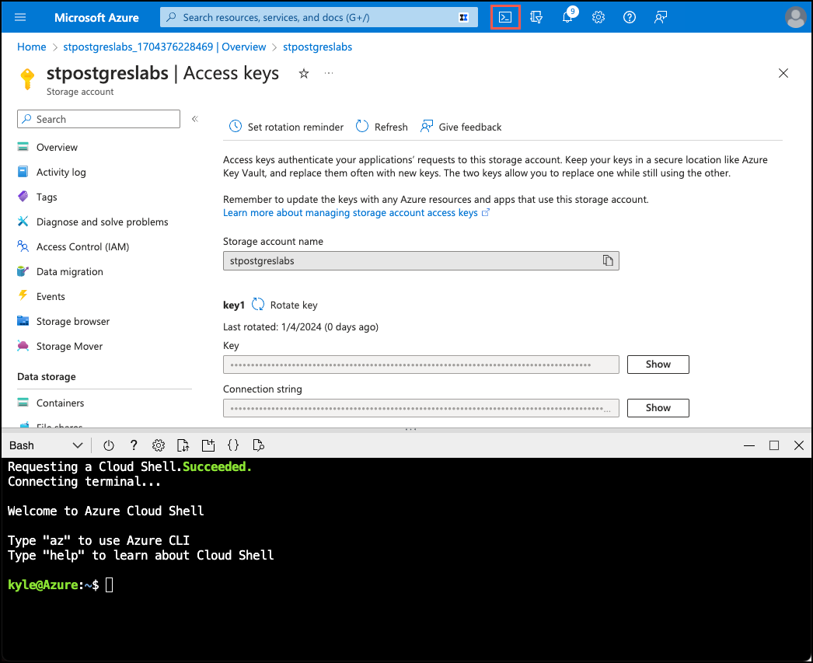

4. At the Azure Cloud Shell prompt, execute the following `curl` commands to download the Seattle Airbnb data files.

    ```bash
    curl -O https://solliancepublicdata.blob.core.windows.net/ms-postgresql-labs/listings.csv
    ```

    ```bash
    curl -O https://solliancepublicdata.blob.core.windows.net/ms-postgresql-labs/calendar.csv
    ```

    ```bash
    curl -O https://solliancepublicdata.blob.core.windows.net/ms-postgresql-labs/reviews.csv
    ```

    The above commands download the files into the storage account associated with your Cloud Shell.

5. Next, you will use the [Azure CLI](https://learn.microsoft.com/cli/azure/) to upload the files into the `seattle-airbnb-data` container you created in your storage account. Create variables to hold your storage account name and key values to make things easier.

    Copy your storage account name by selecting the **Copy to clipboard** button next to the storage account name on the Access keys page above your Cloud Shell:

    

    Now, execute the following command at the Cloud Shell prompt to create a variable for your storage account name, replacing the `{your_storage_account_name}` token with your storage account name.

    ```bash
    ACCOUNT_NAME={your_storage_account_name}
    ```

    Next, select the **Show** button next to the **Key** for **key1** and then select the **Copy to clipboard** button next to the key's value.

    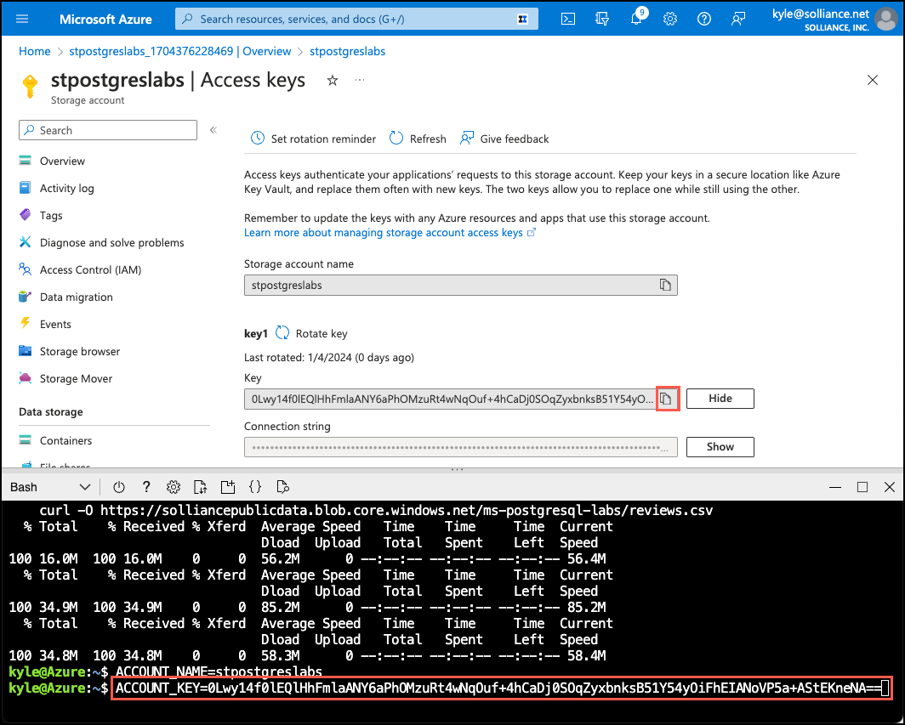

    Then, run the following, replacing the `{your_storage_account_key}` token with the key value you copied.

    ```bash
    ACCOUNT_KEY={your_storage_account_key}
    ```

5. You are now ready to upload the data files. To accomplish this, you will use the [`az storage blob upload`](https://learn.microsoft.com/cli/azure/storage/blob?view=azure-cli-latest#az-storage-blob-upload) CLI command from the Cloud Shell prompt. Run the following commands to upload the three data files into your storage account's `seattle-airbnb-data` container.

    ```bash
    az storage blob upload --account-name $ACCOUNT_NAME --account-key $ACCOUNT_KEY --container-name seattle-airbnb-data --file listings.csv --name listings.csv --overwrite
    ```

    ```bash
    az storage blob upload --account-name $ACCOUNT_NAME --account-key $ACCOUNT_KEY --container-name seattle-airbnb-data --file calendar.csv --name calendar.csv --overwrite
    ```

    ```bash
    az storage blob upload --account-name $ACCOUNT_NAME --account-key $ACCOUNT_KEY --container-name seattle-airbnb-data --file reviews.csv --name reviews.csv --overwrite
    ```

    In this exercise, you are working with a small number of files. You will most likely work with many more files in real-world scenarios. In those circumstances, you can review different methods for [migrating files to an Azure Storage account](https://learn.microsoft.com/azure/storage/common/storage-use-azcopy-migrate-on-premises-data) and select the technique that will work best for your situation.

6. To verify the files uploaded successfully, navigate to your storage account's **Containers** page by selecting **Containers** from the left-hand navigation menu. Select the `seattle-airbnb-data` container from the list of containers and observe that it now contains three files, named `calendar.csv`, `listings.csv`, and `reviews.csv.`

    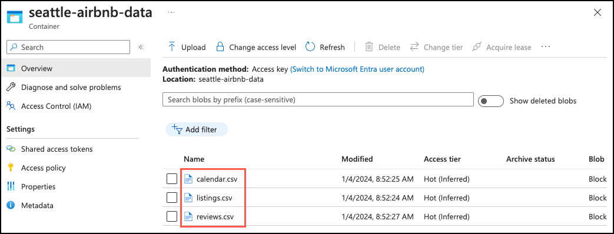

### Task 5: Connect to the database using psql in the Azure Cloud Shell

With the files now securely stored in blob storage, it's time to set up the `pg_azure_storage` extension in your database. You will use the `psql` command line utility from the [Azure Cloud Shell](https://learn.microsoft.com/azure/cloud-shell/overview).

1. You need the connection details for your database to connect to it using `psql` in the Cloud Shell. Navigate to your Azure Database for PostgreSQL Flexible Server resource in the [Azure portal](https://portal.azure.com/), and in the left-hand navigation menu, select **Connect** under **Settings**.

    

2. With the **Connect** page open, select the **Cloud Shell** icon in the Azure portal toolbar to open a new [Cloud Shell](https://learn.microsoft.com/azure/cloud-shell/overview) pane at the bottom of your browser window.

    

3. From the database's **Connect** page in the Azure portal, select **airbnb** for the **Database name**, then copy the **Connection details** block and paste it into the Cloud Shell.

    

4. At the Cloud Shell prompt, replace the `{your_password}` token with the password you assigned to the `s2admin` user when creating your database, then run the command. If you followed the instructions in Lab 1, the password should be `Seattle123Seattle123`.

5. Connect to your database using the `psql` by entering the following at the prompt:

    ```bash
    psql
    ```

    Connecting to the database from the Cloud Shell requires that the `Allow public access from any Azure service within Azure to the server` box is checked on the **Networking** page of the database. If you receive a message that you are unable to connect, please verify this is checked and try again.

### Task 6: Enable and configure the pg_azure_storage extension

Now that you are connected to your database, you can install the `pg_azure_storage` extension. You install extensions using the [CREATE EXTENSION](https://www.postgresql.org/docs/current/sql-createextension.html) command.

1. From the `psql` prompt in the Cloud Shell, run the following command to install the extension in your database:

    ```sql
    CREATE EXTENSION azure_storage;
    ```

    When creating and working with the `pg_azure_storage` extension in your database, note that the extension's name is abbreviated to `azure_storage`.

2. To ensure the **s2admin** account you specified as the database administrator has appropriate permissions to add a storage account in the `pg_azure_storage` extension, run the following command to `GRANT` it the necessary rights.

    ```sql
    GRANT azure_storage_admin TO s2admin;
    ```

3. With the extension now installed, you can configure the extension to connect to your storage account. You will need the name and key associated with your storage account. Using the same browser tab where the Cloud Shell is open, navigate to your storage account resource in the [Azure portal](https://portal.azure.com/). In the left-hand navigation menu, select **Access keys** under **Security + networking**.

    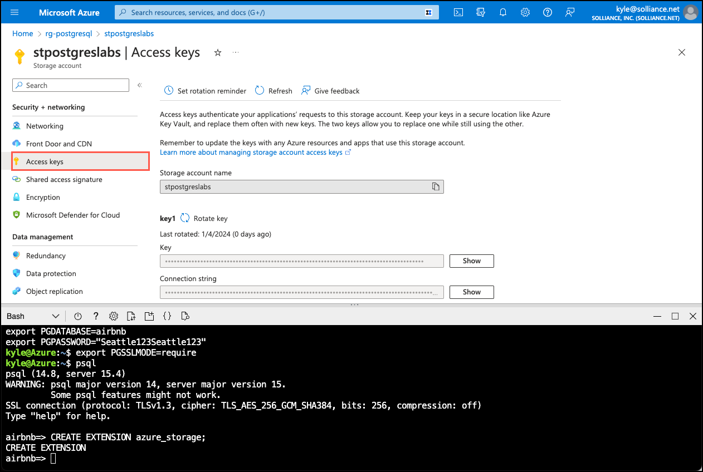

4. Before importing data from blob storage, you must map to the storage account using the `account_add` method, providing the account access key defined when the account was created. At the `psql` prompt, execute the following command after replacing the `{your_storage_account_name}` and `{your_storage_account_key}` tokens with the **Storage account name** and **Key** values, respectively.

    ```sql
    SELECT azure_storage.account_add('{your_storage_account_name}', '{your_storage_account_key}');
    ```

5. Once your storage account has been mapped, you can list the storage account contents. After replacing the `{your_storage_account_name}` token with the **Storage account name**, run the following command to view the list of files in the `seattle-airbnb-data` container:

    ```sql
    SELECT path, bytes, pg_size_pretty(bytes), content_type
    FROM azure_storage.blob_list('{your_storage_account_name}', 'seattle-airbnb-data');
    ```

    The `blob_list` function output should be similar to the following:

    

### Task 7: Import data from blob storage

With the `pg_azure_storage` extension now connected to your blob storage account, you can import the data it contains into your database. Using the queries below, you will create a new schema in the database, add tables to the new schema, and then import data from the files in blob storage into the new tables using the `pg_azure_storage` extension.

1. To host the new tables and avoid conflicts with existing ones, you will create a new schema named `abb` in the database. To create a new schema, use the following command:

    ```sql
    CREATE SCHEMA IF NOT EXISTS abb;
    ```

2. Before importing data, you must create tables to store data from the CSV files. Run the commands below to create the three required tables in the `abb` schema. The table structures are based on the columns defined in each file.

    ```sql
    CREATE TABLE abb.calendar
    (
        listing_id bigint,
        date date,
        available boolean,
        price text
    );
    ```

    ```sql
    CREATE TABLE abb.listings
    (
        id bigint PRIMARY KEY,
        listing_url text,
        scrape_id bigint,
        last_scraped date,
        name text,
        summary text,
        space text,
        description text,
        experiences_offered text,
        neighborhood_overview text,
        notes text,
        transit text,
        thumbnail_url text,
        medium_url text,
        picture_url text,
        xl_picture_url text,
        host_id bigint,
        host_url text,
        host_name text,
        host_since date,
        host_location text,
        host_about text,
        host_response_time text,
        host_response_rate text,
        host_acceptance_rate text,
        host_is_superhost boolean,
        host_thumbnail_url text,
        host_picture_url text,
        host_neighbourhood text,
        host_listings_count int,
        host_total_listings_count int,
        host_verifications text,
        host_has_profile_pic boolean,
        host_identity_verified boolean,
        street text,
        neighbourhood text,
        neighbourhood_cleansed text,
        neighbourhood_group_cleansed text,
        city text,
        state text,
        zipcode text,
        market text,
        smart_location text,
        country_code text,
        country text,
        latitude float,
        longitude float,
        is_location_exact boolean,
        property_type text,
        room_type text,
        accommodates int,
        bathrooms real,
        bedrooms int,
        beds int,
        bed_type text,
        amenities text,
        square_feet int,
        price text,
        weekly_price text,
        monthly_price text,
        security_deposit text,
        cleaning_fee text,
        guests_included int,
        extra_people text,
        minimum_nights int,
        maximum_nights int,
        calendar_updated text,
        has_availability boolean,
        availability_30 int,
        availability_60 int,
        availability_90 int,
        availability_365 int,
        calendar_last_scraped date,
        number_of_reviews int,
        first_review date,
        last_review date,
        review_scores_rating int,
        review_scores_accuracy int,
        review_scores_cleanliness int,
        review_scores_checkin int,
        review_scores_communication int,
        review_scores_location int,
        review_scores_value int,
        requires_license boolean,
        license text,
        jurisdiction_names text,
        instant_bookable boolean,
        cancellation_policy text,
        require_guest_profile_picture boolean,
        require_guest_phone_verification boolean,
        calculated_host_listings_count int,
        reviews_per_month numeric
    );
    ```

    ```sql
    CREATE TABLE abb.reviews
    (
        listing_id bigint,
        id bigint PRIMARY KEY,
        date date,
        reviewer_id bigint,
        reviewer_name text,
        comments text
    );
    ```

3. You can now import data using the `pg_azure_storage` extension. Starting with the `calendar.csv` file, use the [blob_get function](https://learn.microsoft.com/azure/postgresql/flexible-server/concepts-storage-extension#import-data-using-blob_get-function) with the [azure_storage.options_csv_get](https://learn.microsoft.com/azure/cosmos-db/postgresql/reference-pg-azure-storage#azure_storageoptions_csv_get) utility function to specify the decoding options for the CSV file. The `blob_get` function retrieves a file from blob storage. For `blob_get` to know how to parse the data, you can explicitly define the columns in the `FROM` clause. Run the following command to import data from the file. Be sure to replace the `{your_storage_account_name}` token with your storage account name.

    ```sql
    INSERT INTO abb.calendar
    SELECT * FROM azure_storage.blob_get('{your_storage_account_name}', 'seattle-airbnb-data', 'calendar.csv', options:= azure_storage.options_csv_get(header=>true)) AS cal_rec (
        listing_id bigint,
        date date,
        available boolean,
        price text
    );
    ```

    Note the `price` column is assigned a `text` data type in the table. This data type assignment occurs because the CSV file contains dollar signs (`$`) and commas (`,`) in some values. You will correct this below to allow numeric operations to occur on the field.

4. With the data imported, you can now fix the data type associated with the `price` column so numeric operations can be conducted on the column.

    ```sql
    ALTER TABLE abb.calendar ALTER column price TYPE numeric USING (REPLACE(REPLACE(price, ',', ''), '$', '')::numeric);
    ```

5. Above, you explicitly defined the columns in the `calendar.csv` file in the `FROM` clause in the `blob_get` function. Alternatively, you can pass a value (`NULL::table_name`), which infers the file's columns based on the definition of the target table. This method is beneficial when the target table has many columns, as with the `listings` table. Note that this requires the file and table to have the same structure. Run the following command to import the `listings` data from the file. Replace the `{your_storage_account_name}` token with your storage account name.

    ```sql
    INSERT INTO abb.listings
    SELECT * FROM azure_storage.blob_get('{your_storage_account_name}','seattle-airbnb-data','listings.csv', NULL::abb.listings,options:= azure_storage.options_csv_get(header=>true));
    ```

6. To load data into the `reviews` table, you will employ the alternative approach for importing data in the `pg_azure_storage` extension and use the [COPY statement](https://learn.microsoft.com/azure/postgresql/flexible-server/concepts-storage-extension#import-data-using-copy-statement). Run the following command to import `reviews` data from blob storage. Be sure to replace the `{your_storage_account_name}` token with your storage account name.

    ```sql
    COPY abb.reviews
    FROM 'https://{your_storage_account_name}.blob.core.windows.net/seattle-airbnb-data/reviews.csv'
    WITH (FORMAT 'csv', header);
    ```

    Using the `COPY` command in conjunction with the `pg_azure_storage` extension allows it to be used against a private, secured blob storage account container by extending the native PostgreSQL `COPY` command to make it capable of handling Azure Blob Storage resource URLs. The `COPY` statement does not allow you to specify columns, so verifying the table and file column definitions match precisely is essential.

7. Run a few queries to verify the data loaded into each table.

    ```sql
    SELECT * FROM abb.calendar WHERE price BETWEEN 100 AND 125 LIMIT 10;
    ```

    ```sql
    SELECT COUNT(id) FROM abb.listings WHERE neighbourhood_group_cleansed = 'Ballard';
    ```

    By running the `\x auto` command below before executing the last query, you enable the extended display to be automatically applied when necessary to make the output from the command easier to view in the Azure Cloud Shell.

    ```sql
    \x auto
    ```

    ```sql
    SELECT listing_id, date, reviewer_name, comments FROM abb.reviews WHERE listing_id = 7202016 LIMIT 3;
    ```

### Task 8: Export data into blob storage using the blob_put function

The `pg_azure_storage` extension also allows data to be exported from an Azure Database for PostgreSQL to Azure blob storage. In this task, you will export the cleansed `calendar` data back to blob storage using the [blob_put function](https://learn.microsoft.com/azure/postgresql/flexible-server/concepts-storage-extension#export-data-from-azure-database-for-postgresql-flexible-server-to-azure-blob-storage).

1. Above, you fixed the data type associated with the `price` column in the `calendar` table by cleaning up unwanted characters from the `text` column and assigning a `numeric` data type to the column. You can push the updated data back into blob storage using the following command. Make sure to replace the `{your_storage_account_name}` token with the name of your storage account before executing the query.

    ```sql
    SELECT azure_storage.blob_put('{your_storage_account_name}', 'seattle-airbnb-data', 'calendar.csv', cal_rec)
    FROM (SELECT listing_id, date, available, price FROM abb.calendar) cal_rec;
    ```

2. After the query completes, navigate to your storage account in the [Azure portal](https://portal.azure.com/), select **Containers** under **Data storage** in the left-hand menu, choose the **seattle-airbnb-data** container, and then download the `calendar.csv` file.

3. Open the file and observe that data in the `price` column not longer contains dollar signs (`$`) or commas (`,`) and that the rows with values contain a numeric value.

## Summary

Congratulations! You have completed the **Working with common PostgreSQL extensions** hands-on lab. In this lab, you explored the powerful extensibility of Azure Database for PostgreSQL Flexible Server by installing and using some common PostgreSQL extensions.

In the next lab, you will continue exploring these capabilities, looking at how you can extend the database to add the power of generative AI and Large Language Models.
